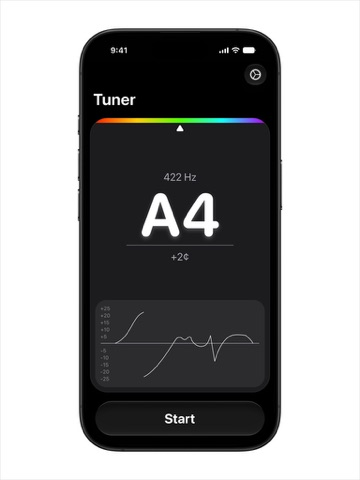
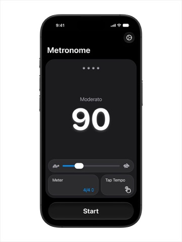
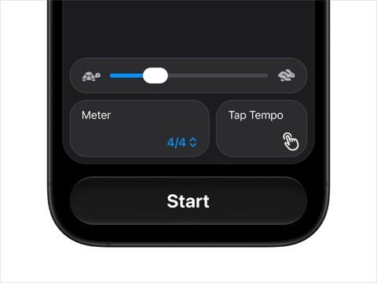
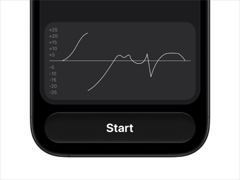
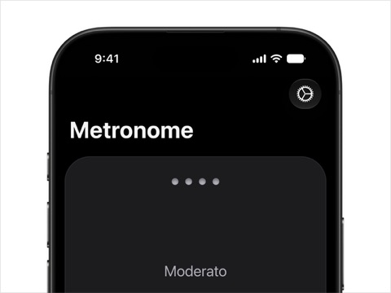
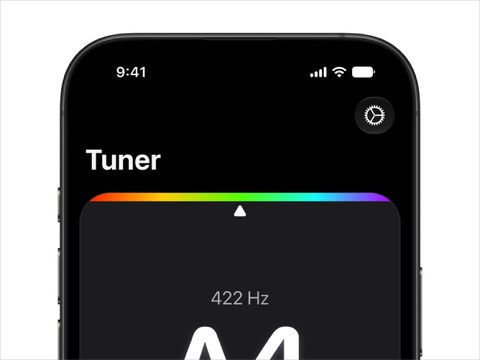

# Tonic

Tonic 是一个专注于即时使用的 iPhone 调音器和节拍器，使用 SwiftUI 与 AVFoundation 构建。

## 界面预览

调音器与节拍器的核心界面：

| 调音器 | 节拍器 |
| --- | --- |
|  |  |

关键交互细节：

| 节拍器控制 | 音高历史图 |
| --- | --- |
|  |  |

调音器和节拍器页面也针对小屏幕布局进行了优化：




## 设计方向

- 使用 SwiftUI 构建界面，保持操作反馈自然、界面切换流畅。
- 采用统一的水平边距、清晰的留白和明确的信息层级，减少视觉噪音。
- 使用大字号呈现核心信息，让音高、偏差和节拍状态易于快速阅读。
- 针对小屏幕优化大字号布局，确保内容不会拥挤、截断或遮挡，控件仍然易于触达。
- 保持界面简洁、美观，并让每个视觉元素服务于调音和练习任务。
- 支持 Dynamic Type、VoiceOver、Reduce Motion 和高对比度设置，让不同使用方式下的内容都清晰可用。

## 功能

- 实时音高检测与音分偏差显示
- A4 = 432 / 440 / 442 Hz 参考音高
- 40-240 BPM 节拍器
- 2/4、3/4、4/4、6/8 拍号
- 音频中断、路由变化和麦克风权限恢复
- 简体中文与 English 本地化
- Dynamic Type、VoiceOver、Reduce Motion 和高对比度支持

## 开发

使用 Xcode 27 或更高版本打开 `ToneTuner.xcodeproj`。项目最低支持 iOS 17。

运行测试：

```sh
xcodebuild test \\
  -project Tonic.xcodeproj \\
  -scheme Tonic \\
  -destination 'generic/platform=iOS Simulator' \\
  CODE_SIGNING_ALLOWED=NO
```

真机使用调音器时，需要在系统设置中允许麦克风访问。

### 开发者诊断接口

Debug 构建支持通过设备控制台读取调音器的实时数据。将 iPhone 连接到 Mac 并安装 Debug 构建后，可以运行：

```sh
scripts/measure_tuner_csv.sh ./tonic-measurement.csv
```

脚本会使用 Mac 的 `ffplay` 生成固定正弦波，依次测试多个频率，并从 iPhone 调试控制台导出 CSV。输出字段为：

脚本会先等待 iPhone 音频引擎报告就绪，再开始播放；同一次运行中的多个频率不会反复重启 App。

- `time`：iPhone 记录的 Unix 时间戳
- `mac_raw`：Mac 命令行音源的目标频率（Hz）
- `app_raw`：iPhone 当前音频窗口的原始估计（Hz）
- `app_smooth`：应用平滑后的估计（Hz）
- `app_level`：输入信号电平
- `display_frequency`、`note_letter`、`note_solfege`：界面实际显示的频率、字母音名和唱名
- `cents`、`chart_index`、`chart_cents`：界面音分偏差，以及图表使用的索引和值

Debug 控制台还会输出 `TONIC_DISPLAY` 行，记录界面实际更新后的频率、字母音名、唱名、音分偏差，以及图表样本索引和图表使用的音分值。`TONIC_CSV` 是底层检测帧；`TONIC_DISPLAY` 是用户可见读数和图表数据。

诊断模式通过 `--tonic-diagnostic` 启动参数开启，只存在于 Debug 编译路径；普通启动和 Release 构建不会输出这些数据。

压力测试可以运行大跳变、随机跳变和线性/二次非线性扫频：

```sh
TONIC_STRESS_SCENARIO=all scripts/stress_tuner.sh ./tonic-stress.csv
```

每个跳变音播放 2 秒；连续扫频段各播放 10 秒。脚本直接读取 iPhone 调试控制台，不需要人工看屏幕。

小提琴调音场景会让 G3、D4、A4 做多轮大幅来回调节，并让通常安装微调器的 E5 弦做多轮小幅细调：

```sh
TONIC_STRESS_SCENARIO=violin scripts/stress_tuner.sh ./tonic-violin.csv
```

`violin-bow` 会在运行时随机生成每根弦的琴轴轨迹、弓长和换弓停顿，并把多次拉弓拼成连续音频；过冲后的下一次调节强制反向，生成的每个弓段会实时写入同名的 `-events.csv`：

```sh
TONIC_STRESS_SCENARIO=violin-bow scripts/stress_tuner.sh ./tonic-violin-bow.csv
```

小提琴场景使用持续 PCM 音频流：弓持续发声，琴轴控制在流播放期间实时读取 iPhone 返回的 `cents` 并更新瞬时频率；手机读数才是调准判据。默认测试容差为 ±1 音分，模拟真实演奏时可使用 `TONIC_TARGET_TOLERANCE_CENTS=5` 放宽到 ±5 音分。播放期间如果 iPhone 停止产生诊断帧（例如用户按下暂停），Mac 会自动停止当前音频。

复杂歌曲测试可以在压力测试后串行运行：

```sh
scripts/stress_tuner.sh ./tonic-stress.csv
scripts/song_tuner.sh ./tonic-song.csv
```

第二个脚本默认使用《两只老虎》的公版旋律，也可以选择 `TONIC_SONG=vivaldi-spring` 测试一段公版风格的《四季·春》短动机，或选择 `TONIC_SONG=ode-to-joy`。脚本会叠加低音、节拍和轻微背景层，并生成 `tonic-song-score.csv`，记录每个短音的起始时间、时长和期望频率。歌曲 CSV 的 `mac_raw` 留空，因为复杂混音不存在单一的 Mac 基准频率，应与 score 文件按时间对照。

## 许可证

[MIT](LICENSE)
